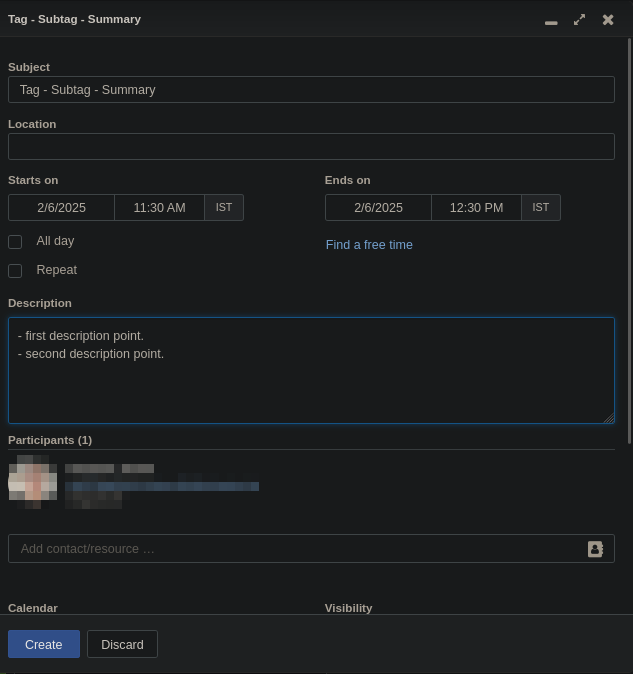
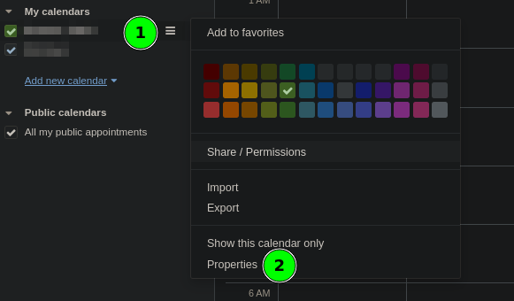
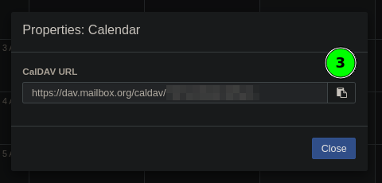

# work-logging

I use  calendar for  maintaining work  logs. A mailbox  calendar lives  online, so
there's no hassle  of syncing a file  with different devices. I can  plan ahead of
time as  I can very  easily see  what time slots  are free. The  company schedules
everything  on  the  calendar so  by  using  calendar  for  work logging,  I  have
everything in one place, my plans, company's plans, etc etc.

If you  use some other  calendar than mailbox.org,  look for the  calendar's APIs,
there would be something  similar available for you to automate  work logging as I
did.

## Step 1: Create a `credentials.py` file

Create a  `credentials.py` file which looks  something like this. I  have attached
the steps below to get the calendar URL for mailbox.org calendars.

```python
username="username@something.com"
password="password"
calendar_url="https://dav.mailbox.org/caldav/calendar_id"
```

## Step 2: Play along with `main.py`

```txt
$ python main.py
Please select one of the options:
0 : quit
1 : last week's summary  (csv)
2 : last week's summary  (detailed)
3 : last month's summary (csv)
4 : last month's summary (detailed)
```
It shows you all the tags and asks which  one you want to see the summary for The.
detailed views also ask if you want to sort the events by subtag or not          .

## How does it work?

- the calendar events not named like `tag - subtag - summary` are ignored.
- it gives you a list of tags and asks which tag you want to get the events for.
- once you select some tag, it prints out all the events for that subtag with nice
  descriptions.
- the description points should start with `- ` and should end with a `\n`.



## Steps to get the calendar_url




